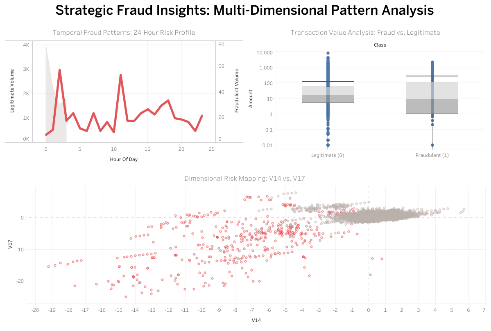

# Credit Card Fraud Detection & Behavioral Analytics

## 📌 Project Overview
This project analyzes a dataset of over **284,000 credit card transactions** to identify fraudulent patterns. Due to the extreme class imbalance (only 0.17% fraud), the analysis focuses on temporal behavior, transaction value distribution, and statistical feature separation.

## 🛠️ Tech Stack
*   **Data Processing:** SQL (PostgreSQL)
*   **Visualization:** Tableau Desktop / Tableau Public
*   **Key Concepts:** Feature Engineering, Downsampling, Risk Scoring, PCA Analysis

## 📊 Key Insights
1.  **The "Midnight Spike":** Fraudulent activities peak at **2:00 AM**, a time when legitimate transaction volume is at its lowest.
2.  **Strategic Transaction Value:** Fraudsters employ a "Two-Pronged Strategy"—utilizing micro-transactions ($< $1) for card testing and mid-to-high value transactions ($200 - $1,000) for exploitation.
3.  **Statistical Fingerprint:** Using PCA features **V14 and V17**, we achieved a clear visual separation between fraud and legitimate clusters, enabling high-precision rule-based filtering.

## 🖼️ Dashboard Preview

> [View the Interactive Dashboard on Tableau Public](https://public.tableau.com/app/profile/jessica.tsai2206/viz/_17755834333420/Dashboard1?publish=yes)

## 📁 Files in this Repository
*   `fraud_analysis_queries.sql`: Complete SQL logic for data cleaning and risk scoring.
*   `README.md`: Project documentation and executive summary.

## ✉️ Contact
**YuChieh Mendaros** - [My LinkedIn Profile Link](https://www.linkedin.com/in/yu-chieh-mendaros-89ba2a1b9/)
